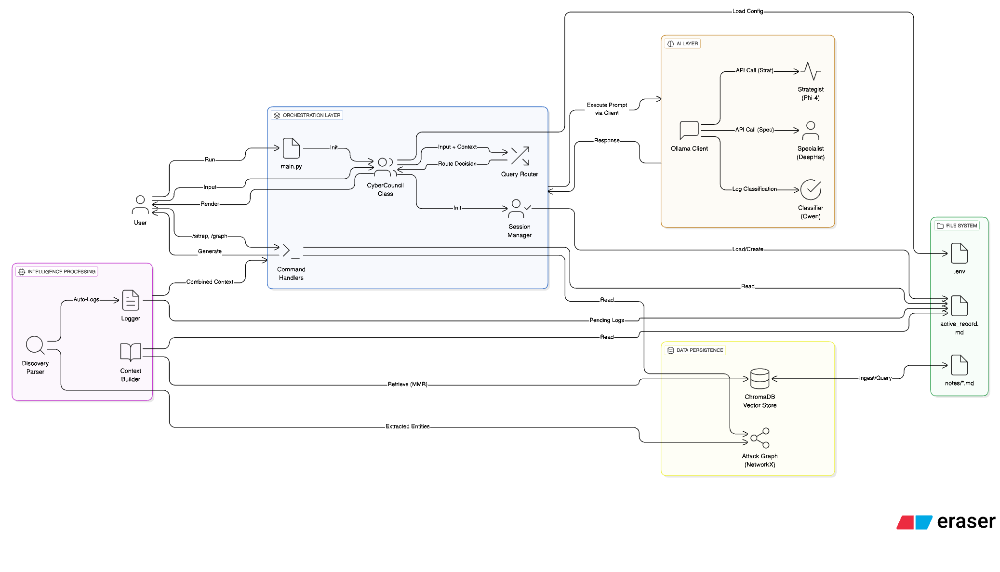

# 🏗️ CyberCouncil System Architecture

This document details the internal architecture, data flow, and component relationships of the CyberCouncil V0.1 system.

## 🔄 System Data Flow

The following flowchart illustrates how user input is processed, routed, and transformed into intelligence.

---

## 📂 Project Structure & Responsibilities

### Core Components (`core/`)
*   **`council.py`**: The central brain. Orchestrates the main loop, handles user input, and coordinates all other components.
*   **`session_manager.py`**: Manages project state (current project, mode) and file system operations for project creation/loading.
*   **`context_builder.py`**: Assembles the "prompt context" for the AI. It combines:
    1.  **Long-term memory**: Relevant notes retrieved from ChromaDB via RAG.
    2.  **Short-term memory**: The current project's `active_record.md`.
*   **`ollama_client.py`**: A robust wrapper for the Ollama API. Handles model validation, exponential backoff retries, and switching between models.
*   **`commands/`**: Encapsulated logic for system commands (`/sitrep`, `/graph`, `/close`) to keep the orchestrator clean.

### AI & Intelligence (`ai/`)
*   **`router.py`**: Determines if a user query is "Strategic" (requires planning/reasoning) or "Tactical" (requires specific syntax/tools).
*   **`vector_engine.py`**: Handles embedding generation (using PyTorch/HuggingFace models) for the RAG system.

### Graph System (`graph/`)
*   **`attack_graph.py`**: Manages a NetworkX graph representation of the engagement. Nodes are entities (IPs, Ports), edges are relationships.
*   **`graph_visualizer.py`**: Renders the graph as ASCII art for the terminal.

### Parsing & Logging (`parsing/`)
*   **`discovery_parser.py`**: Regex-based engine that scans user input for IPs, ports, CVEs, and credentials to automatically populate the graph.
*   **`logger.py`**: Manages the "Pending Logs" queue, allowing the user to review AI-detected findings before committing them to the permanent record.

### Data Storage
*   **`db/`**: ChromaDB persistence directory (Vector Store).
*   **`projects/`**: Directory containing all user projects.
    *   `active_record.md`: The single source of truth for an engagement.
    *   `attack_graph.json`: Exported graph data.
    *   `FINAL_REPORT.md`: Generated report upon project closure.
